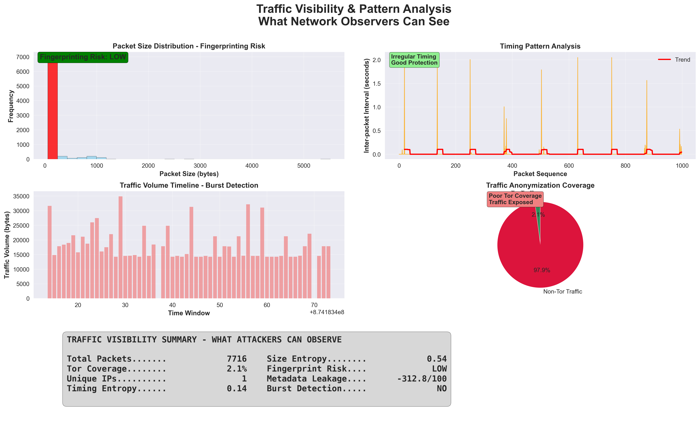
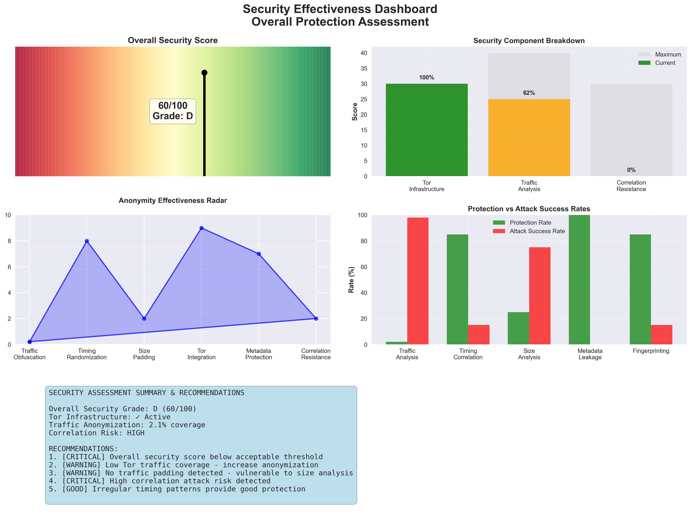

# Anonymous Terminal Messenger

A secure, anonymous messaging application that uses Tor hidden services and end-to-end encryption to provide private communication channels.

## Video Showcase


_Click above to watch a complete demonstration of the anonymous messenger in action, including server setup, client connections, and security testing._

## Technical Architecture Diagram

```
┌─────────────────────────────────────────────────────────────────────────────────────┐
│                           ANONYMOUS MESSAGING SYSTEM                                │
└─────────────────────────────────────────────────────────────────────────────────────┘

┌─────────────────────────────────────────────────────────────────────────────────────┐
│                                SERVER SIDE                                          │
├─────────────────────────────────────────────────────────────────────────────────────┤
│                                                                                     │
│  ┌─────────────────┐    ┌──────────────────┐    ┌─────────────────────────────────┐ │
│  │   Python App    │    │   Tor Process    │    │      Hidden Service         │ │
│  │  (Server Mode)  │    │                  │    │   abc123def456.onion       │ │
│  │                 │    │  ┌─────────────┐ │    │                             │ │
│  │ • TorManager    │◄──►│  │ Hidden Svc  │ │◄──►│  • Generated .onion addr    │ │
│  │ • SecureMsg     │    │  │ Controller  │ │    │  • Private key stored       │ │
│  │ • AnonymousServ │    │  └─────────────┘ │    │  • Port mapping: 80→8080    │ │
│  │                 │    │                  │    │                             │ │
│  │ Listens on:     │    │  SOCKS: 9050     │    └─────────────────────────────────┘ │
│  │ localhost:8080  │    │  Control: 9051   │                                       │
│  └─────────────────┘    └──────────────────┘                                       │
│           │                       │                                                │
│           │              ┌────────▼────────┐                                       │
│           │              │  Tor Network    │                                       │
│           │              │                 │                                       │
│           │              │ ┌─────────────┐ │                                       │
│           │              │ │Entry Relay  │ │                                       │
│           │              │ └─────┬───────┘ │                                       │
│           │              │       │         │                                       │
│           │              │ ┌─────▼───────┐ │                                       │
│           │              │ │Middle Relay │ │                                       │
│           │              │ └─────┬───────┘ │                                       │
│           │              │       │         │                                       │
│           │              │ ┌─────▼───────┐ │                                       │
│           │              │ │Exit/Rendez. │ │                                       │
│           │              │ │   Point     │ │                                       │
│           │              │ └─────────────┘ │                                       │
│           │              └─────────────────┘                                       │
│           │                       │                                                │
└───────────┼───────────────────────┼────────────────────────────────────────────────┘
            │                       │
            │              ┌────────▼────────┐
            │              │  Tor Network    │
            │              │   (3-hop path)  │
            │              └────────┬────────┘
            │                       │
┌───────────┼───────────────────────┼────────────────────────────────────────────────┐
│           │                       │                            CLIENT SIDE         │
├───────────┼───────────────────────┼────────────────────────────────────────────────┤
│           │                       │                                                │
│  ┌────────▼────────┐    ┌────────▼────────┐    ┌─────────────────────────────────┐ │
│  │   Python App    │    │   Tor Process   │    │      Connection String         │ │
│  │  (Client Mode)  │    │   (SOCKS Proxy) │    │                                 │ │
│  │                 │    │                 │    │ abc123def456.onion:             │ │
│  │ • TorManager    │◄──►│  SOCKS: 9050    │    │ base64_encryption_key_here      │ │
│  │ • SecureMsg     │    │  (or 9051-9054) │    │                                 │ │
│  │ • AnonymousClnt │    │                 │    │ • Onion address for connection  │ │
│  │                 │    │ Routes all      │    │ • Fernet encryption key         │ │
│  │ Connects via:   │    │ traffic through │    │ • Shared out-of-band securely   │ │
│  │ SOCKS proxy     │    │ Tor network     │    │                                 │ │
│  └─────────────────┘    └─────────────────┘    └─────────────────────────────────┘ │
│                                                                                     │
└─────────────────────────────────────────────────────────────────────────────────────┘

┌─────────────────────────────────────────────────────────────────────────────────────┐
│                              MESSAGE FLOW                                           │
├─────────────────────────────────────────────────────────────────────────────────────┤
│                                                                                     │
│ Client A                    Tor Network                    Server                   │
│    │                           │                             │                     │
│    │ 1. Encrypt message        │                             │                     │
│    │    with Fernet key        │                             │                     │
│    │                           │                             │                     │
│    │ 2. Add padding to         │                             │                     │
│    │    512B/1KB/2KB/4KB       │                             │                     │
│    │                           │                             │                     │
│    │ 3. Send via SOCKS         │                             │                     │
│    │    proxy to Tor           │                             │                     │
│    │                           │                             │                     │
│    ├──────────────────────────►│ 4. Route through 3 hops    │                     │
│    │                           │    (Entry→Middle→Exit)      │                     │
│    │                           │                             │                     │
│    │                           ├────────────────────────────►│ 5. Deliver to       │
│    │                           │                             │    hidden service   │
│    │                           │                             │                     │
│    │                           │                             │ 6. Relay encrypted  │
│    │                           │                             │    message to all   │
│    │                           │                             │    connected clients│
│    │                           │                             │                     │
│    │                           │ 7. Route back through      ◄┤                     │
│    │                           │    different 3-hop path    │                     │
│    │                           │                             │                     │
│    ◄───────────────────────────┤ 8. Deliver to Client B     │                     │
│    │                           │    via SOCKS proxy         │                     │
│    │                           │                             │                     │
│    │ 9. Decrypt with           │                             │                     │
│    │    shared Fernet key      │                             │                     │
│    │                           │                             │                     │
│    │ 10. Remove padding &      │                             │                     │
│    │     display message       │                             │                     │
│                                                                                     │
└─────────────────────────────────────────────────────────────────────────────────────┘

┌─────────────────────────────────────────────────────────────────────────────────────┐
│                           SECURITY LAYERS                                           │
├─────────────────────────────────────────────────────────────────────────────────────┤
│                                                                                     │
│ Layer 1: Network Anonymity                                                          │
│ ┌─────────────────────────────────────────────────────────────────────────────────┐ │
│ │ • Tor Hidden Services (.onion addresses)                                       │ │
│ │ • 3-hop onion routing (Entry → Middle → Exit/Rendezvous)                       │ │
│ │ • No IP address exposure for server or clients                                 │ │
│ │ • Circuit refresh every 5 minutes                                              │ │
│ │ • Traffic routed through different paths                                       │ │
│ └─────────────────────────────────────────────────────────────────────────────────┘ │
│                                                                                     │
│ Layer 2: Message Encryption                                                         │
│ ┌─────────────────────────────────────────────────────────────────────────────────┐ │
│ │ • Fernet symmetric encryption (AES-128 + HMAC-SHA256)                          │ │
│ │ • Cryptographically secure key generation                                      │ │
│ │ • Base64-encoded keys for sharing                                               │ │
│ │ • Server never sees plaintext (zero-knowledge relay)                           │ │
│ └─────────────────────────────────────────────────────────────────────────────────┘ │
│                                                                                     │
│ Layer 3: Traffic Analysis Protection                                                │
│ ┌─────────────────────────────────────────────────────────────────────────────────┐ │
│ │ • Message padding to fixed sizes (512B, 1KB, 2KB, 4KB)                        │ │
│ │ • Random timing delays (0.5-3 seconds between messages)                        │ │
│ │ • Dummy traffic generation (every 30-60 seconds)                               │ │
│ │ • No message size or timing correlation possible                               │ │
│ └─────────────────────────────────────────────────────────────────────────────────┘ │
│                                                                                     │
│ Layer 4: Memory & Data Protection                                                   │
│ ┌─────────────────────────────────────────────────────────────────────────────────┐ │
│ │ • Secure memory zeroing (3-pass overwrite)                                     │ │
│ │ • Memory locking (prevents swap to disk)                                       │ │
│ │ • Temporary file cleanup                                                        │ │
│ │ • All logging disabled                                                          │ │
│ └─────────────────────────────────────────────────────────────────────────────────┘ │
│                                                                                     │
└─────────────────────────────────────────────────────────────────────────────────────┘

┌─────────────────────────────────────────────────────────────────────────────────────┐
│                        ONION SERVICE CREATION PROCESS                               │
├─────────────────────────────────────────────────────────────────────────────────────┤
│                                                                                     │
│ Step 1: Key Generation                                                              │
│ ┌─────────────────────────────────────────────────────────────────────────────────┐ │
│ │ • Tor generates ED25519 private/public key pair                                 │ │
│ │ • Public key hashed to create .onion address                                   │ │
│ │ • Format: [16-char-hash].onion (v2) or [56-char-hash].onion (v3)              │ │
│ │ • Private key stored securely in Tor data directory                            │ │
│ └─────────────────────────────────────────────────────────────────────────────────┘ │
│                                                                                     │
│ Step 2: Service Registration                                                        │
│ ┌─────────────────────────────────────────────────────────────────────────────────┐ │
│ │ • Tor creates hidden service descriptor                                         │ │
│ │ • Descriptor contains: public key, service info, introduction points           │ │
│ │ • Published to distributed hash table (DHT) in Tor network                     │ │
│ │ • Rendezvous points selected for client connections                             │ │
│ └─────────────────────────────────────────────────────────────────────────────────┘ │
│                                                                                     │
│ Step 3: Connection Establishment                                                    │
│ ┌─────────────────────────────────────────────────────────────────────────────────┐ │
│ │ • Client looks up .onion address in Tor DHT                                     │ │
│ │ • Retrieves service descriptor and introduction points                          │ │
│ │ • Establishes circuit to rendezvous point                                      │ │
│ │ • Server and client meet at rendezvous point                                   │ │
│ │ • Direct encrypted tunnel established (no exit node needed)                    │ │
│ └─────────────────────────────────────────────────────────────────────────────────┘ │
│                                                                                     │
└─────────────────────────────────────────────────────────────────────────────────────┘

┌─────────────────────────────────────────────────────────────────────────────────────┐
│                           TRAFFIC CHARACTERISTICS                                    │
├─────────────────────────────────────────────────────────────────────────────────────┤
│                                                                                     │
│ Protocol Stack:                                                                     │
│ ┌─────────────────────────────────────────────────────────────────────────────────┐ │
│ │ Application Layer:  Encrypted Messages (Fernet)                                │ │
│ │ Transport Layer:    TCP (reliable delivery)                                     │ │
│ │ Network Layer:      Tor Onion Routing (3 layers of encryption)                 │ │
│ │ Physical Layer:     Standard Internet (but anonymized)                         │ │
│ └─────────────────────────────────────────────────────────────────────────────────┘ │
│                                                                                     │
│ Traffic Flow:                                                                       │
│ • NOT HTTPS: Direct TCP connection through Tor                                     │
│ • Each Tor hop adds/removes one layer of encryption                                │
│ • Final connection to hidden service is direct (no exit node)                     │
│ • All traffic appears as Tor traffic to ISP/network observers                     │
│ • Message content encrypted separately with Fernet (double encryption)            │
│                                                                                     │
└─────────────────────────────────────────────────────────────────────────────────────┘
```

## Research Background

This implementation is based on research documented at: [Research Document - Anonymous Messaging Systems](https://nbaburov.notion.site/Research-Document-1cf258cb140c8007bca7fcdd6543120e?pvs=74)

## Overview

This application creates an anonymous messaging system where users can communicate without revealing their IP addresses or identities. It combines Tor's anonymity network with strong encryption to protect both message content and metadata.

## How It Works

### Architecture

The system operates in two modes:

-   **Server Mode**: Creates a Tor hidden service (.onion address) that others can connect to
-   **Client Mode**: Connects to existing hidden services using connection strings

### Core Components

1. **TorManager**: Manages Tor process and hidden service creation
2. **SecureMessenger**: Handles encryption/decryption and traffic obfuscation
3. **AnonymousServer**: Manages client connections and message relay
4. **AnonymousClient**: Handles client-side connection and UI

## Security Measures & Anonymity Protocols

### Network Anonymity

-   **Tor Hidden Services**: All communication routed through Tor's onion routing
-   **No IP Address Exposure**: Server and clients never reveal real IP addresses
-   **Circuit Refresh**: Automatic Tor circuit renewal every 5 minutes
-   **Enhanced Tor Configuration**:
    -   New circuits every 30 seconds
    -   Distinct subnet enforcement
    -   IPv6 disabled to prevent leaks
    -   Minimal disk writes

### Encryption & Message Security

-   **Fernet Encryption**: Symmetric encryption using cryptographically secure keys
-   **Message Padding**: Fixed-size message padding (512B, 1KB, 2KB, 4KB) to prevent size analysis
-   **Timing Obfuscation**: Random delays (0.5-3 seconds) between messages
-   **Dummy Traffic**: Periodic fake messages to obscure communication patterns
-   **Perfect Forward Secrecy**: Prepared for ECDH key exchange (currently uses Fernet for compatibility)

### Memory & Data Protection

-   **Secure Memory Zeroing**: Multiple-pass memory clearing for sensitive data
-   **Memory Locking**: Prevents sensitive data from being swapped to disk (when available)
-   **Temporary File Cleanup**: Automatic cleanup of Tor data directories
-   **Logging Disabled**: All Python logging disabled to prevent metadata leakage

### Traffic Analysis Protection

-   **Fixed Message Sizes**: Messages padded to standard sizes
-   **Dummy Traffic Generation**: Regular fake messages every 30-60 seconds
-   **Timing Randomization**: Variable delays to prevent timing correlation
-   **Connection Obfuscation**: Multiple retry attempts with delays

## Installation & Usage

### Prerequisites

```bash
# Install Tor
# Ubuntu/Debian:
sudo apt-get install tor

# macOS:
brew install tor

# Install Python dependencies for messenger
pip install -r requirements.txt

# Install additional dependencies for security testing
pip install -r pentest_requirements.txt
```

### Required Python Packages

**For Messenger:**

```
stem>=1.8.0
cryptography>=3.0.0
rich>=10.0.0
PySocks>=1.7.0
requests>=2.25.0
```

**For Security Testing:**

```
scapy>=2.4.0
matplotlib>=3.0.0
seaborn>=0.11.0
numpy>=1.19.0
pandas>=1.3.0
psutil>=5.8.0
```

### Usage

#### Starting a Server

```bash
# Interactive mode
python anon_messenger.py

# Direct server mode
python anon_messenger.py --server
```

The server will:

1. Start Tor and create a hidden service
2. Generate an encryption key
3. Display a connection string like: `abc123def456.onion:encryption_key_here`

#### Connecting as Client

```bash
# Interactive mode
python anon_messenger.py

# Direct client mode
python anon_messenger.py --client "onion_address:encryption_key"
```

#### Chat Commands

-   Type messages and press Enter to send
-   Type `quit`, `exit`, `/quit`, or `/exit` to disconnect
-   Ctrl+C to force exit

## Security Testing & Analysis

The project includes a comprehensive penetration testing tool (`pentest_anon_messenger.py`) that demonstrates the security and anonymity of the messenger by analyzing what data can and cannot be observed through various network analysis techniques.

### Purpose of Security Testing

The penetration testing tool serves as proof-of-concept to demonstrate:

-   What network traffic is visible to observers
-   How the messenger's security measures protect against common attacks
-   Traffic analysis resistance and correlation attack prevention
-   Tor infrastructure security assessment

### Running Security Tests

#### Prerequisites for Testing

The tool requires root/administrator privileges for packet capture:

```bash
# Linux/macOS - Install system dependencies
sudo apt-get install python3-dev libpcap-dev  # Ubuntu/Debian
brew install libpcap  # macOS
```

#### Basic Security Testing

```bash
# Run comprehensive security test (60 seconds)
sudo python3 pentest_anon_messenger.py

# Quick test (30 seconds)
sudo python3 pentest_anon_messenger.py --quick

# Custom duration
sudo python3 pentest_anon_messenger.py --duration 120

# Specify network interface
sudo python3 pentest_anon_messenger.py --interface eth0

# Generate detailed report and visualizations
sudo python3 pentest_anon_messenger.py --report security_analysis.json --plots
```

#### Testing Workflow

1. **Start the Anonymous Messenger** (in separate terminal):

    ```bash
    python3 anon_messenger.py --server
    ```

2. **Run the Pentest Tool** (requires root):

    ```bash
    sudo python3 pentest_anon_messenger.py --duration 60 --plots
    ```

3. **Connect Clients** (in separate terminals):

    ```bash
    python3 anon_messenger.py --client "onion_address:key"
    ```

4. **Send Messages** to generate traffic for analysis

5. **Review Results** in the pentest tool output and generated plots

### Security Analysis Features

#### Network Traffic Analysis

-   **Packet Capture**: Real-time network packet interception
-   **Traffic Pattern Analysis**: Timing, size, and flow analysis
-   **Tor Traffic Detection**: Identification of Tor-related communications
-   **Connection Mapping**: Analysis of network connections and patterns

#### Security Assessment

-   **Tor Infrastructure Analysis**: Detection and configuration assessment
-   **Correlation Attack Simulation**: Traffic correlation vulnerability testing
-   **Timing Analysis**: Detection of regular patterns that could aid attacks
-   **Padding Detection**: Verification of message padding effectiveness

#### Reporting

-   **Real-time Display**: Live security analysis with Rich UI
-   **Security Scoring**: Numerical security assessment (0-100)
-   **Detailed Reports**: JSON export of all findings
-   **Recommendations**: Specific security improvement suggestions

### Security Visualizations

The pentest tool generates three comprehensive security visualizations that provide critical insights for research into anonymous messaging security:

#### 1. Traffic Visibility Analysis



**What it shows:**

-   **Packet Size Distribution**: Color-coded fingerprinting risk analysis
-   **Timing Pattern Analysis**: Inter-packet timing with correlation risk assessment
-   **Traffic Volume Timeline**: Burst detection and volume pattern analysis
-   **Tor Coverage Analysis**: Percentage of traffic protected by anonymization
-   **Comprehensive Summary**: Metrics including entropy, metadata leakage, and fingerprinting risk

**Research Value:** Quantifies what network attackers can observe and demonstrates effectiveness of anonymity protections.

#### 2. Security Effectiveness Dashboard



**What it shows:**

-   **Overall Security Score**: 0-100 gauge with letter grade (A-F)
-   **Component Breakdown**: Tor Infrastructure, Traffic Analysis, Correlation Resistance
-   **Anonymity Radar**: Multi-dimensional security assessment across 6 categories
-   **Protection vs Attack Success**: Defense effectiveness against specific attack types
-   **Recommendations**: Prioritized security improvements with urgency levels

**Research Value:** Comprehensive assessment of security measures effectiveness and overall protection quality.

#### 3. Attack Surface Risk Matrix


**What it shows:**

-   **Risk Matrix**: Likelihood vs Impact analysis for different attack vectors
-   **Attack Timeline**: Success probability over time for various attack scenarios
-   **Defense Analysis**: Theoretical vs actual implementation effectiveness
-   **Adversary Assessment**: Protection levels against different threat actors
-   **Vulnerability Heatmap**: Systematic assessment across network layers
-   **Mitigation Roadmap**: Priority-based action items for security improvements

**Research Value:** Comprehensive threat modeling and vulnerability assessment with actionable mitigation strategies.

### Analysis Phases

#### Phase 1: Tor Infrastructure Analysis

**What it checks:**

-   Tor process detection and configuration
-   Port analysis (SOCKS, Control ports)
-   Tor connectivity testing
-   Security configuration assessment

**Expected Results:**

-   ✓ Tor processes running
-   ✓ SOCKS proxy functional
-   ✓ Secure configuration detected

#### Phase 2: Network Traffic Analysis

**What it captures:**

-   All TCP packets on specified interface
-   Packet timing and size patterns
-   Connection establishment and teardown
-   Tor-specific traffic identification

**What it analyzes:**

-   Traffic volume and patterns
-   Message size distribution
-   Timing regularity
-   Padding effectiveness

#### Phase 3: Security Assessment

**Scoring Criteria:**

-   **Tor Infrastructure (30 points)**: Proper Tor setup and connectivity
-   **Traffic Analysis (40 points)**: Padding, timing obfuscation, Tor usage
-   **Correlation Risk (30 points)**: Resistance to traffic correlation attacks

**Grade Scale:**

-   A (90-100): Excellent security
-   B (80-89): Good security
-   C (70-79): Adequate security
-   D (60-69): Poor security
-   F (0-59): Inadequate security

### What the Tool Demonstrates

#### Observable Data (What Attackers Can See)

1. **Network Metadata:**

    - Connection timestamps
    - Packet sizes and timing
    - Traffic volume
    - Tor usage (but not destinations)

2. **Traffic Patterns:**
    - Communication frequency
    - Burst patterns
    - Connection durations

#### Protected Data (What Attackers Cannot See)

1. **Message Content:**

    - All messages are encrypted end-to-end
    - No plaintext content visible

2. **Real IP Addresses:**

    - All traffic routed through Tor
    - Only localhost connections visible

3. **Message Recipients:**

    - Hidden service addresses not exposed
    - No correlation between users

4. **Message Sizes:**
    - Padding obscures actual message lengths
    - Fixed-size packets prevent size analysis

### Security Measures Demonstrated

#### Traffic Analysis Protection

-   **Padding Detection**: Verifies messages are padded to fixed sizes (512B, 1KB, 2KB, 4KB)
-   **Timing Obfuscation**: Detects random delays between messages (0.5-3 seconds)
-   **Dummy Traffic**: Identifies fake messages sent periodically

#### Anonymity Protection

-   **Tor Integration**: Verifies all traffic routes through Tor network
-   **Circuit Management**: Detects automatic circuit refresh (every 5 minutes)

#### Correlation Attack Resistance

-   **Pattern Analysis**: Tests for regular timing patterns
-   **Traffic Bursts**: Identifies bursts that could aid correlation
-   **Risk Assessment**: Overall correlation risk (LOW/MEDIUM/HIGH)

### Interpreting Results

#### Good Security Indicators

-   ✓ Tor processes running and configured securely
-   ✓ Padding detected in traffic analysis
-   ✓ No regular timing patterns
-   ✓ Low correlation attack risk
-   ✓ Security score 80+ (Grade B or better)

#### Security Concerns

-   ✗ Regular timing patterns detected
-   ✗ No padding in messages
-   ✗ High correlation attack risk
-   ✗ Tor connectivity issues
-   ✗ Security score below 70 (Grade C or worse)

### Troubleshooting Security Tests

#### Common Issues

**Permission Denied:**

```bash
# Solution: Run with sudo
sudo python3 pentest_anon_messenger.py
```

**No Packets Captured:**

```bash
# Check interface name
ip addr show  # Linux
ifconfig      # macOS
# Use correct interface
sudo python3 pentest_anon_messenger.py --interface eth0
```

**Tor Not Detected:**

```bash
# Start Tor manually
tor &
# Or use system Tor
sudo systemctl start tor  # Linux
brew services start tor   # macOS
```

## Vulnerability Assessment

### High Risk Vulnerabilities

#### 1. **Correlation Attacks**

-   **Risk**: Traffic pattern analysis could correlate users
-   **Mitigation**: Enhanced dummy traffic, variable timing
-   **Severity**: High

#### 2. **Memory Attacks**

-   **Risk**: Sensitive data in memory could be extracted
-   **Mitigation**: Better memory protection, secure enclaves
-   **Severity**: High

#### 3. **Tor Network Attacks**

-   **Risk**: Tor network compromise or traffic analysis
-   **Mitigation**: Use bridges, guard node selection
-   **Severity**: High

### Medium Risk Vulnerabilities

#### 4. **Side-Channel Attacks**

-   **Risk**: Timing, power, or electromagnetic analysis
-   **Mitigation**: Constant-time operations, hardware security
-   **Severity**: Medium

#### 5. **Implementation Bugs**

-   **Risk**: Cryptographic implementation flaws
-   **Mitigation**: Code audits, formal verification
-   **Severity**: Medium

#### 6. **Dependency Vulnerabilities**

-   **Risk**: Vulnerabilities in third-party libraries
-   **Mitigation**: Regular updates, dependency scanning
-   **Severity**: Medium

### Low Risk Vulnerabilities

#### 7. **Local System Compromise**

-   **Risk**: Malware or system-level attacks
-   **Mitigation**: System hardening, sandboxing
-   **Severity**: Low (requires local access)

#### 8. **Social Engineering**

-   **Risk**: Users revealing connection strings
-   **Mitigation**: User education, secure sharing methods
-   **Severity**: Low (user error)

## Deanonymization Risks

### Network-Level Attacks

1. **Global Passive Adversary**: Could correlate traffic patterns
2. **Tor Node Compromise**: Malicious entry/exit nodes
3. **ISP Monitoring**: Deep packet inspection and timing analysis
4. **DNS Leaks**: Potential DNS resolution outside Tor

### Application-Level Attacks

1. **Fingerprinting**: Unique usage patterns or behaviors
2. **Metadata Analysis**: Message timing and size correlation
3. **Key Compromise**: If encryption keys are exposed
4. **Protocol Attacks**: Exploitation of implementation flaws

### Mitigation Strategies

-   Use VPN + Tor for additional layers
-   Regular circuit refresh and key rotation
-   Consistent dummy traffic patterns
-   Avoid revealing personal information in messages
-   Use from isolated, hardened systems

## Security Assumptions

This system assumes:

-   Tor network is functioning and not completely compromised
-   Local system is secure and not compromised
-   Users follow operational security practices
-   Cryptographic libraries are implemented correctly
-   No global passive adversary with unlimited resources

## Recommended Improvements

### Security Enhancements

1. **Perfect Forward Secrecy**: Implement full ECDH key exchange
2. **Post-Quantum Cryptography**: Add quantum-resistant algorithms
3. **Message Authentication**: Add HMAC for message integrity
4. **Key Rotation**: Automatic periodic key rotation
5. **Secure Key Exchange**: Implement secure initial key exchange protocol

### Anonymity Improvements

1. **Bridge Support**: Add Tor bridge configuration for censored networks
2. **Pluggable Transports**: Support for obfs4 and other transports
3. **Guard Node Selection**: Custom guard node configuration
4. **Exit Node Avoidance**: Ensure all traffic stays within Tor network

### Operational Security

1. **Sandboxing**: Run in isolated containers or VMs
2. **Memory Protection**: Enhanced memory protection mechanisms
3. **Secure Boot**: Verify system integrity
4. **Network Isolation**: Prevent non-Tor network access

### Usability & Features

1. **Group Chat**: Multi-user chat rooms
2. **File Transfer**: Secure file sharing capabilities
3. **Message History**: Encrypted local message storage
4. **User Authentication**: Optional user verification
5. **Mobile Support**: Cross-platform compatibility

## Technical Implementation Details

### Security Utilities (Lines 1-80)

#### Core Security Functions

-   **`secure_zero_memory(data)`**: Overwrites sensitive data in memory 3 times with zeros to prevent recovery
-   **`lock_memory(data)`**: Uses mlock to prevent memory pages from being swapped to disk
-   **Logging Disabled**: All Python logging and urllib3 warnings disabled to prevent metadata leakage

### TorManager Class (Lines 81-272)

#### Purpose

Manages Tor process lifecycle, hidden service creation, and circuit management for anonymity.

#### Key Methods

**`find_free_port(start_port=9050)`**

-   Scans ports sequentially to find available SOCKS/control ports
-   Prevents port conflicts when multiple instances run

**`check_existing_tor()`**

-   Attempts to connect to existing Tor instance on default ports (9050/9051)
-   Tests SOCKS proxy functionality before proceeding
-   Applies security configurations to existing instance

**`start_tor()`**

-   Creates temporary data directory with secure permissions
-   Launches Tor with hardened configuration:
    -   `NewCircuitPeriod: 30s` - Forces frequent circuit changes
    -   `EnforceDistinctSubnets: 1` - Prevents same-subnet relay usage
    -   `ClientUseIPv6: 0` - Disables IPv6 to prevent leaks
    -   `AvoidDiskWrites: 1` - Minimizes forensic traces
-   Establishes controller connection for circuit management

**`create_hidden_service(port)`**

-   Creates ephemeral hidden service in temporary directory
-   Handles different stem API versions for compatibility
-   Returns .onion address for client connections
-   Waits 5 seconds for service propagation

**`_start_circuit_refresh()`**

-   Spawns daemon thread for automatic circuit renewal every 5 minutes
-   Sends NEWNYM signal to force new circuits
-   Prevents long-term traffic correlation

### SecureMessenger Class (Lines 273-468)

#### Purpose

Handles end-to-end encryption, message padding, timing obfuscation, and dummy traffic generation.

#### Key Methods

**`generate_key()`**

-   Creates Fernet symmetric key using cryptographically secure random generator
-   Returns base64-encoded key for sharing

**`set_key(key_str)`**

-   Validates and sets encryption key from connection string
-   Handles base64 padding correction
-   Initializes Fernet cipher suite

**`_derive_message_key(message_id)`**

-   Prepared for ECDH implementation using HKDF key derivation
-   Would derive unique keys per message for perfect forward secrecy
-   Currently unused (Fernet compatibility mode)

**`_pad_message(message)`**

-   Adds random padding (16-80 bytes) to obscure message length
-   Selects target size from fixed MESSAGE_SIZES array
-   Format: `[4-byte length][message][random padding]`
-   Prevents traffic analysis based on message size

**`_unpad_message(padded_data)`**

-   Extracts original message from padded data
-   Reads 4-byte length prefix to determine message boundaries
-   Handles legacy unpadded messages for backward compatibility

**`_apply_timing_obfuscation()`**

-   Enforces random delays (0.5-3 seconds) between messages
-   Prevents timing correlation attacks
-   Tracks last send time to ensure minimum intervals

**`encrypt_message(message)`**

-   Applies timing obfuscation before encryption
-   Pads message to fixed size
-   Uses Fernet authenticated encryption
-   Returns base64-encoded ciphertext

**`decrypt_message(encrypted_message)`**

-   Decrypts Fernet token
-   Removes padding to recover original message
-   Handles both padded and legacy message formats

**`generate_dummy_message()`**

-   Creates fake messages with random content
-   Prefixed with "DUMMY:" for identification
-   Used for traffic analysis protection

**`is_dummy_message(decrypted_message)`**

-   Identifies dummy traffic by "DUMMY:" prefix
-   Prevents dummy messages from being displayed

### AnonymousServer Class (Lines 469-618)

#### Purpose

Manages server-side operations including client connections, message relay, and dummy traffic generation.

#### Key Methods

**`start()`**

-   Initializes TorManager and creates hidden service
-   Binds TCP socket to localhost:8080
-   Generates encryption key and displays connection string
-   Starts dummy traffic generation thread
-   Accepts client connections in main loop

**`_start_dummy_traffic()`**

-   Spawns daemon thread for periodic dummy message generation
-   Sends fake messages every 30-60 seconds (randomized)
-   Broadcasts dummy traffic to all connected clients
-   Maintains traffic flow even during idle periods

**`handle_client(client_socket)`**

-   Manages individual client connections in separate threads
-   Relays encrypted messages between clients without decryption
-   Removes failed clients from connection pool
-   No message content inspection (zero-knowledge relay)

**`stop()`**

-   Gracefully shuts down server and cleans up resources
-   Closes all client connections
-   Triggers TorManager and SecureMessenger cleanup

### AnonymousClient Class (Lines 619-829)

#### Purpose

Handles client-side connection establishment, message sending/receiving, and user interface.

#### Key Methods

**`connect(connection_string)`**

-   Parses connection string format: `onion_address:encryption_key`
-   Sets up encryption using provided key
-   Discovers working Tor SOCKS proxy (ports 9050-9054)
-   Establishes connection through Tor to hidden service
-   Implements retry logic with exponential backoff

**`receive_messages()`**

-   Runs in separate thread to handle incoming messages
-   Decrypts received messages using SecureMessenger
-   Filters out dummy traffic before display
-   Continues on decryption errors (resilient to malformed data)

**`send_message(message)`**

-   Encrypts message using SecureMessenger
-   Sends over established Tor connection
-   Displays sent message to user
-   Handles connection failures gracefully

**`input_handler()`**

-   Processes user input in separate thread
-   Handles quit commands (`quit`, `exit`, `/quit`, `/exit`)
-   Sends non-empty messages through encrypted channel
-   Manages graceful disconnection

**`start_chat_ui()`**

-   Initializes interactive chat interface using Rich library
-   Starts input handler thread
-   Maintains main loop until disconnection
-   Handles keyboard interrupts (Ctrl+C)

**`disconnect()`**

-   Closes socket connection
-   Triggers SecureMessenger cleanup
-   Sets connection flag to false

### Main Application Logic (Lines 830-898)

#### Purpose

Provides command-line interface and orchestrates server/client modes.

#### Key Components

**Argument Parsing**

-   `--server`: Starts in server mode
-   `--client <connection_string>`: Connects as client
-   No arguments: Interactive mode selection

**Interactive Mode**

-   Prompts user to choose server or client mode
-   Handles connection string input for client mode
-   Provides clean exit on keyboard interrupt

**Error Handling**

-   Graceful cleanup on exceptions
-   Proper resource deallocation
-   Silent failure handling for security

### Security Constants

```python
MESSAGE_SIZES = [512, 1024, 2048, 4096]  # Fixed message sizes for padding
DUMMY_TRAFFIC_INTERVAL = 30  # Send dummy traffic every 30 seconds
MIN_MESSAGE_DELAY = 0.5  # Minimum delay between messages
MAX_MESSAGE_DELAY = 3.0  # Maximum delay between messages
CIRCUIT_REFRESH_INTERVAL = 300  # Refresh Tor circuit every 5 minutes
```

### Threading Architecture

1. **Main Thread**: UI/connection management
2. **Receive Thread**: Message reception and decryption
3. **Input Thread**: User input processing
4. **Dummy Traffic Thread**: Periodic fake message generation
5. **Circuit Refresh Thread**: Tor circuit renewal

## Research Applications

### Academic Research

-   **Traffic Analysis Studies**: Use visibility analysis to quantify what attackers can observe
-   **Anonymity Metrics**: Radar charts provide multi-dimensional anonymity assessment
-   **Threat Modeling**: Risk matrices enable systematic threat analysis
-   **Defense Evaluation**: Compare theoretical vs actual protection effectiveness

### Security Assessment

-   **Penetration Testing**: Comprehensive vulnerability identification
-   **Risk Management**: Prioritized mitigation roadmaps
-   **Compliance**: Quantified security scoring for audits
-   **Monitoring**: Track security improvements over time

### System Development

-   **Design Validation**: Verify anonymity protections work as intended
-   **Performance Tuning**: Balance security vs performance trade-offs
-   **Feature Prioritization**: Focus development on highest-impact security improvements

## Research & Development

For detailed research methodology, threat modeling, and implementation decisions, see the complete research documentation: [Research Document](https://nbaburov.notion.site/Research-Document-1cf258cb140c8007bca7fcdd6543120e?pvs=74)

## Disclaimer

This software is for educational and research purposes. Users are responsible for compliance with local laws and regulations. The authors make no guarantees about the security or anonymity provided by this system.

## Contributing

Security improvements and bug reports are welcome. Please follow responsible disclosure for security vulnerabilities.

## License

MIT License - See [LICENSE](LICENSE) file for details
